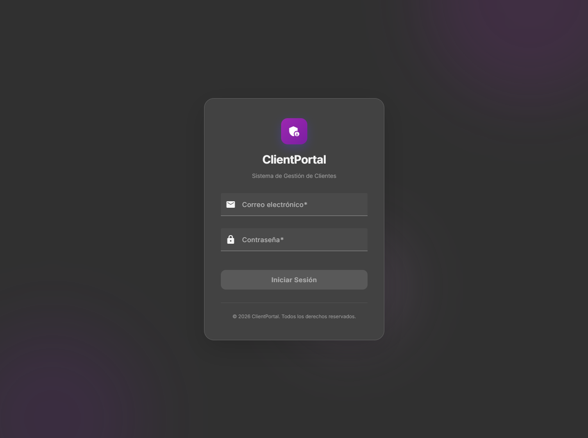
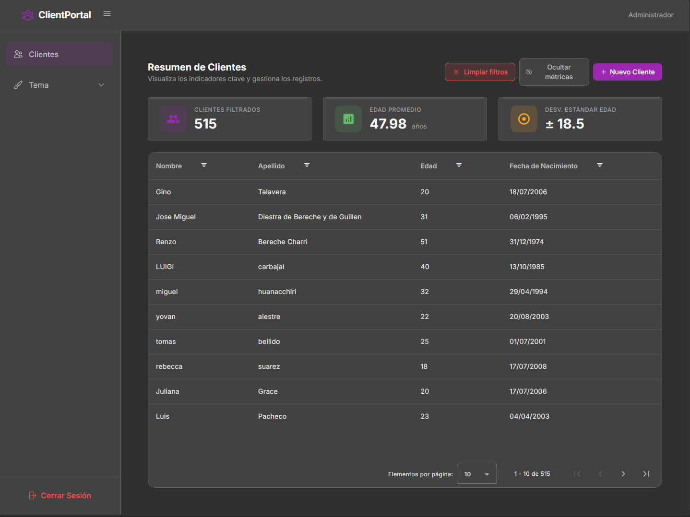
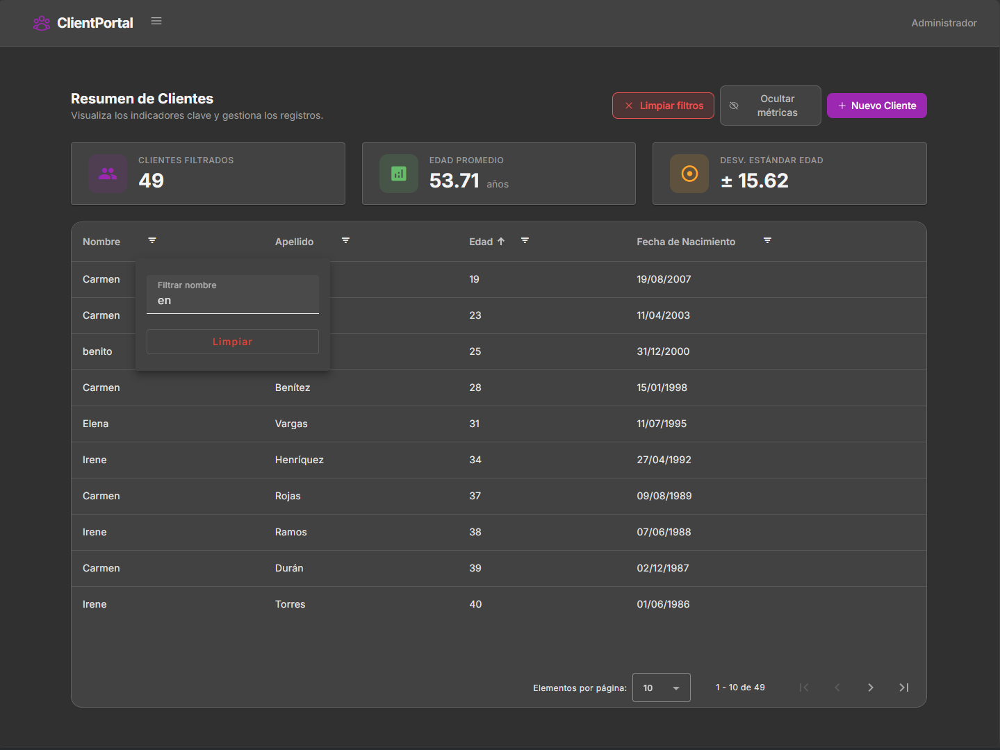

# Client Management Website

[](https://angular.io)
[](https://firebase.google.com)
[](https://tailwindcss.com)
[](https://www.typescriptlang.org)
[](LICENSE)

Sistema web de gestión de clientes con autenticación, dashboard y operaciones CRUD. Construido con Angular 15, Firebase (Firestore + Auth) y siguiendo Clean Architecture.

---

## Tabla de Contenidos

- [Capturas de Pantalla](#capturas-de-pantalla)
- [Tecnologías](#tecnologías)
- [Características](#características)
- [Arquitectura](#arquitectura)
- [Estructura del Proyecto](#estructura-del-proyecto)
- [Primeros Pasos](#primeros-pasos)
  - [Pre-requisitos](#pre-requisitos)
  - [Instalación](#instalación)
  - [Configuración de Firebase](#configuración-de-firebase)
  - [Desarrollo](#desarrollo)
  - [Build](#build)
- [Scripts Disponibles](#scripts-disponibles)
- [Testing](#testing)
- [Base de Datos (Firestore)](#base-de-datos-firestore)
- [Temas](#temas)
- [CI/CD](#cicd)
- [Limitaciones Conocidas](#limitaciones-conocidas)
- [Licencia](#licencia)

---

## Capturas de Pantalla

| Login | Dashboard | Clientes |
|-------|-----------|----------|
|  |  |  |
| Inicio de sesión con email/contraseña | Sidebar responsive con selector de tema | Tabla con filtros, ordenamiento, paginación y métricas |

---

## Tecnologías

| Categoría | Tecnología | Versión |
|-----------|-----------|---------|
| **Framework** | Angular (Standalone Components) | ~15.2 |
| **Lenguaje** | TypeScript | ~4.9 |
| **UI** | Angular Material (CDK, Dialog, SnackBar, Table) | ~15.2 |
| **Estilos** | Tailwind CSS con variables CSS para theming | ~3.4 |
| **Iconos** | @ng-icons/heroicons | ~20.0 |
| **Backend** | Firebase Firestore (NoSQL) | ~9.23 |
| **Autenticación** | Firebase Authentication (email/password) | ~9.23 |
| **Integración Firebase** | @angular/fire | ~7.6 |
| **Testing** | Jasmine + Karma | ~4.5 / ~6.4 |
| **CI/CD** | GitHub Actions + Firebase Hosting | — |
| **Reactive State** | RxJS (BehaviorSubject) | ~7.8 |

---

## Características

### Autenticación
- Inicio de sesión con email y contraseña (Firebase Auth)
- Guard de ruta (`auth.guard`) que redirige a `/auth` si no hay sesión
- Persistencia de sesión

### Dashboard
- **Sidebar responsive:** colapsable en tablet (768-1023px), menú hamburguesa en móvil
- **Selector de 4 temas** Angular Material, persistidos en localStorage
- **Logout** con manejo de errores

### Gestión de Clientes (CRUD)
- **Crear:** Modal con validación (edad >= 18, nombre y apellido requeridos, coherencia edad/fecha nacimiento)
- **Listar:** Tabla Angular Material paginada, ordenable por columnas
- **Actualizar:** Edición parcial con timestamp `updatedAt`
- **Eliminar:** No expuesto (Firestore rules: `allow delete: if false`)
- **Filtros:** Búsqueda por nombre/apellido, rango de edad, rango de fecha de nacimiento
- **Métricas:** Total de clientes, edad promedio, desviación estándar (toggle de visibilidad)

### UX
- Overlay de carga global durante operaciones asíncronas
- Notificaciones toast (MatSnackBar) con feedback de éxito/error
- Pantalla de carga inicial con verificación de datos listos (`dataReadyGuard`)
- Página de error dedicada (`/error`)
- Diseño responsive (mobile < 768px, tablet 768-1023px, desktop >= 1024px)

### Manejo de Errores
- Clases de error personalizadas: `AppError`, `AuthError`, `NetworkError`, `FirestoreError`
- `GlobalErrorHandler` que captura excepciones no manejadas
- `mapFirebaseError`: traduce códigos de error de Firebase a mensajes amigables
- Operador RxJS `handleErrors` para manejo de errores en pipes

---

## Arquitectura

El proyecto sigue **Clean Architecture** con tres capas principales:

```
┌─────────────────────────────────────────────────┐
│                 presentation/                     │
│  (Componentes UI organizados por features)        │
│  auth, dashboard/clients, error, loading-data     │
├─────────────────────────────────────────────────┤
│                     domain/                       │
│  (Modelos, interfaces de repositorio, casos de uso)│
├─────────────────────────────────────────────────┤
│                      data/                        │
│  (DTOs, mappers, implementaciones Firebase)       │
└─────────────────────────────────────────────────┘
```

- **Inyección de dependencias** via `InjectionTokens` (`CLIENT_REPOSITORY`, `AUTH_REPOSITORY`) para bajo acoplamiento
- **Casos de uso** como única puerta de entrada a la lógica de negocio
- **Mappers** convierten entre DTOs (Firestore) y modelos de dominio
- **State management** centralizado en `ClientsStateService` con `BehaviorSubject` + operadores RxJS para datos, filtros y métricas derivadas

---

## Estructura del Proyecto

```
src/
├── app/
│   ├── core/                   # Capa transversal
│   │   ├── adapters/           # Adaptadores (fechas)
│   │   ├── components/         # Componentes compartidos (loading-overlay)
│   │   ├── config/             # Configuración (Firebase, fechas)
│   │   ├── decorators/         # Decoradores
│   │   ├── errors/             # Sistema de errores
│   │   ├── guards/             # Route guards (auth, data-ready)
│   │   ├── helpers/            # Utilidades (date, math)
│   │   ├── interfaces/         # Interfaces compartidas
│   │   ├── services/           # Servicios globales (theme, toast, loading, state)
│   │   ├── tokens/             # Injection tokens
│   │   └── validators/         # Validadores personalizados
│   ├── data/                   # Capa de datos
│   │   ├── dtos/               # Data Transfer Objects
│   │   ├── mappers/            # Mapeo DTO <-> Domain
│   │   └── repositories/       # Implementaciones Firebase
│   ├── domain/                 # Capa de dominio
│   │   ├── models/             # Modelos de negocio + validación
│   │   ├── repositories/       # Interfaces abstractas
│   │   └── use-cases/          # Casos de uso
│   └── presentation/           # Capa de presentación
│       └── features/
│           ├── auth/           # Módulo de autenticación
│           ├── dashboard/      # Dashboard + gestión clientes
│           ├── error/          # Página de error
│           └── loading-data/   # Pantalla de carga inicial
├── environments/               # Configuración por entorno
├── themes/                     # Temas Angular Material
│   └── material-themes.scss    # 4 temas predefinidos
├── styles.scss                 # Estilos globales
└── index.html                  # Entry point
```

---

## Primeros Pasos

### Pre-requisitos

- Node.js 18+
- npm 9+
- Una cuenta de Firebase con un proyecto activo

### Instalación

```bash
git clone <repo-url>
cd client-managment-website
npm install
```

### Configuración de Firebase

1. Ve a [Firebase Console](https://console.firebase.google.com/), crea o selecciona un proyecto
2. Habilita **Authentication** con el proveedor **Email/Password**
3. Crea una base de datos **Firestore** en modo producción
4. Copia el archivo de entorno de ejemplo:

```bash
cp .env.local.example .env.local
```

5. Completa `.env.local` con las credenciales de tu aplicación web de Firebase:

```env
FIREBASE_API_KEY=AIzaSy...
FIREBASE_AUTH_DOMAIN=tu-proyecto.firebaseapp.com
FIREBASE_DATABASE_URL=https://tu-proyecto.firebaseio.com
FIREBASE_PROJECT_ID=tu-proyecto
FIREBASE_STORAGE_BUCKET=tu-proyecto.appspot.com
FIREBASE_MESSAGING_SENDER_ID=123456789
FIREBASE_APP_ID=1:123456789:web:abc123
```

6. *(Opcional)* Poblar la base de datos con datos de prueba:

   > **Nota:** El script `scripts/seed.js` está incluido en el repositorio, pero requiere la clave de servicio de Firebase Admin SDK (`scripts/serviceAccount.json`) que **no** está incluida (está en `.gitignore`). Descárgala desde Firebase Console > Ajustes del proyecto > Cuentas de servicio y colócala en `scripts/serviceAccount.json`.

   ```bash
   node scripts/seed.js
   ```

   Esto generará 500 clientes aleatorios usando listas internas de nombres y apellidos hispanos.

### Desarrollo

```bash
npm start
```

Navega a `http://localhost:4200/`. La aplicación se recarga automáticamente con HMR.

> El comando `prestart` ejecuta `node replace-env.js` para inyectar las variables de entorno de Firebase en `src/environments/environment.ts`.

### Build

```bash
npm run build
```

Los archivos de producción se generan en `dist/`.

---

## Scripts Disponibles

| Script | Comando | Descripción |
|--------|---------|-------------|
| `npm start` | `node replace-env.js && ng serve` | Servidor de desarrollo con HMR |
| `npm run build` | `node replace-env.js && ng build` | Build de producción |
| `npm run watch` | `ng build --watch --configuration development` | Build en modo watch |
| `npm test` | `ng test` | Ejecutar tests unitarios (Karma) |
| `npm run ng` | `ng` | Acceso directo a Angular CLI |

---

## Testing

Los tests unitarios están escritos en **Jasmine** con **Karma** como test runner.

```bash
npm test
```

### Cobertura de tests

| Capa | Archivos con test |
|------|------------------|
| **Domain** | `client.model`, `get-clients.use-case`, `create-client.use-case`, `sign-in.use-case` |
| **Data** | `client.mapper`, `firebase-error.mapper` |
| **Core** | `toast.service`, `auth.guard`, `data-ready.guard` |
| **Presentation** | `dashboard.component`, `clients.component`, `sidebar.component`, `loading-data.component`, `create-client-modal.component` |

---

## Base de Datos (Firestore)

### Colecciones

**`clients`** — Documentos con la siguiente estructura:

```typescript
{
  name: string;           // 2-50 caracteres
  lastname: string;       // 2-50 caracteres
  age: number;            // 18-150
  birthDate: string;      // ISO string (YYYY-MM-DD)
  createdAt: string;      // ISO datetime
  updatedAt: string;      // ISO datetime
}
```

### Reglas de Seguridad

```javascript
rules_version = '2';
service cloud.firestore {
  match /databases/{database}/documents {
    match /clients/{document} {
      allow read, create, update: if request.auth != null;
      allow delete: if false; // Eliminación deshabilitada
    }
  }
}
```

### Seed Script

`scripts/seed.js` genera 500 registros de clientes aleatorios usando listas internas de nombres y apellidos hispanos. Requiere una clave de servicio de Firebase Admin SDK (`scripts/serviceAccount.json`), la cual no está incluida en el repositorio.

---

## Temas

La aplicación incluye 4 temas de Angular Material intercambiables en tiempo real:

1. **Deep Purple / Amber** (default)
2. **Indigo / Pink**
3. **Pink / Blue-Grey**
4. **Purple / Green**

El tema seleccionado se persiste en `localStorage`. El theming usa variables CSS con prefijo `t-` para que Tailwind CSS consuma los colores del tema activo.

---

## CI/CD

El archivo `.github/workflows/firebase-hosting.yml` despliega automáticamente a Firebase Hosting usando **Node 20**:

- **Rama `main`** → despliegue automático en producción
- **Pull requests** → despliegue en preview channel
- Usa secretos de GitHub Actions para las credenciales de Firebase

El proyecto incluye un `firebase.json` configurado con rewrites SPA (todas las rutas → `index.html`).

---

## Limitaciones Conocidas

### Paginación
La paginación se realiza en el frontend debido a que Firestore no soporta saltos eficientes (offset) sin leer documentos previos. La paginación por cursor requiere conocer el último documento visible. Para listas muy grandes, esto puede impactar en costos de lectura.

### Filtrado y Ordenamiento
Se procesan en el frontend porque Firestore tiene limitaciones en consultas compuestas (requiere índices manuales) y no permite combinar múltiples filtros con ordenamiento dinámico fácilmente. Aceptable para volúmenes moderados de datos.

### Manejo de Fechas
`createdAt` y `updatedAt` se almacenan como strings ISO (`YYYY-MM-DDTHH:mm:ss.sssZ`) en lugar de `Timestamp` de Firestore para simplificar el manejo en el frontend. Si se requiere tiempo de servidor garantizado, migrar a `serverTimestamp()`.

---

## Licencia

Distribuido bajo licencia MIT. Consulta el archivo `LICENSE` para más información.
